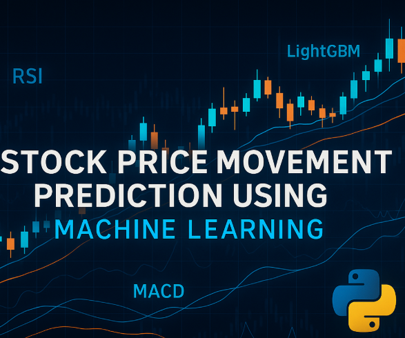

# 📊 Stock Price Movement Prediction Using Machine Learning

Predicting whether a stock’s price will go Up or Down the next day based on **technical indicators**.

 <!-- Replace with your actual banner or project image -->

---

## Project Overview

This project explores whether **technical indicators** such as RSI, MACD, and Moving Averages can help predict short-term stock price direction (next-day "Up" or "Down").

Despite the challenge of noise and randomness in the market, this project applies **classic and modern ML models** to see what works, what doesn’t, and why.

---

## Goal

Can we train a machine learning model to predict if a stock will go up or down the next day based on historical price and technical features?

---

## Directory Structure

```text

├── data/
│ ├── features_X.csv # Processed feature matrix
│ ├── labels_y.csv # Binary target labels (1 = Up, 0 = Down)
├── notebooks/
│ ├── 01_data_collection_and_feature_engineering.ipynb
│ ├── 02_model_training_and_evaluation.ipynb
├── assets/
│ ├── sample_chart.png # Plots for README
├── requirements.txt
└── README.md

```

---

## Technical Indicators Used

| Feature | Description |
|--------|-------------|
| SMA20, SMA50 | Simple moving averages over 20 & 50 days |
| RSI | Relative Strength Index (momentum indicator) |
| MACD, MACD Signal | Trend reversal indicator |
| Lag Features | RSI, MACD, and SMA values from previous 1–2 days |

---

## Dataset

- **Stock**: Apple Inc. (AAPL)
- **Source**: Yahoo Finance via `yfinance`
- **Time Range**: Jan 2020 – Dec 2024
- **Frequency**: Daily

---

## Machine Learning Models Used

| Model                | Key Insights |
|---------------------|--------------|
| Logistic Regression | Baseline, interpretable |
| Random Forest       | Handles non-linearity, okay recall |
| XGBoost             | More stable, higher precision |
| LightGBM            | Final model, best trade-off |

---

## Results (LightGBM - Final Model)

**Confusion Matrix:**


**Classification Report:**

| Metric       | Down (0) | Up (1) |
|--------------|----------|--------|
| Precision    | 0.42     | 0.55   |
| Recall       | 0.71     | 0.27   |
| F1-score     | 0.53     | 0.36   |

**Takeaway**:  
Models find it easier to predict "Down" movements, but struggle with "Up" days. This reflects real-world difficulty of price forecasting based only on historical technical data.

---

## Feature Importance (LightGBM)


---

## Visuals

**Closing Price & Moving Averages:**


**RSI Over Time:**


---

## Tools Used

- Python 3.10
- `pandas`, `numpy`, `scikit-learn`, `lightgbm`, `matplotlib`, `seaborn`
- `ta` for technical indicator calculation
- `yfinance` for stock data

---

## Future Improvements

- Add **news sentiment features** using FinBERT or VADER
- Use **rolling window cross-validation**
- Try **sequence models** like LSTM for deeper patterns

---

## 📎 How to Run

```bash
# Clone the repo
git clone https://github.com/your-username/stock-price-prediction.git
cd stock-price-prediction

# Install dependencies
pip install -r requirements.txt

# Open notebooks to explore
jupyter notebook
